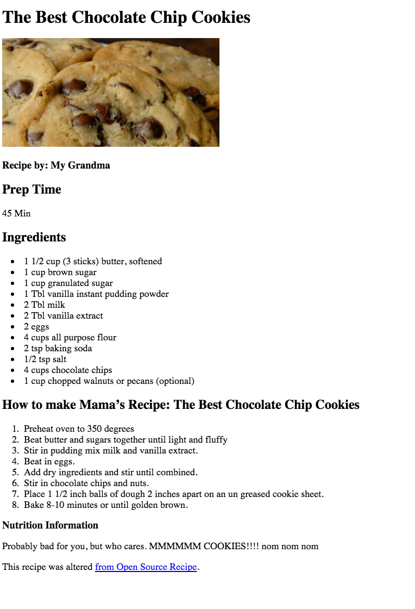

#Welcome to FEWD 39!

##Instructor Information
- Sandi Ma: sandima.job@gmail.com
- Melody Serra: melodyserra@gmail.com
- Celeste Layne: layne.celeste@gmail.com

##Installation
- Install [Sublime Text](http://www.sublimetext.com/)
	- Sublime Text is a text-editor for code.  


##What is front-end web development?
- Everything your eyes can see on the page. 
- Composed of HTML, CSS, and JavaScript.
- A front-end developer will take the work of a designer, and code it on the front-end so a back-end developer can build on top of that. 

###What is HTML? 
- Stands for: Hyper Text Markup Language.
- It is the content of the page. 
	- e.g. header or paragraph
- Has its own default styles. 

###What is CSS?
- Stands for: Cascading Style Sheet. 
- It is the stylistic component of the page. 
- Overrides the default styles of HTML. 
	- e.g. change the color or the font-family of your header.

###What is JavaScript?
- Helps increase interactivity of the page. 
- Helps with page interactions such as animations. 
- Helps with dynamic loading of content. 

##Class Activity

##How is back-end web development different?
- The back-end enables the greater functionality of the website. 
- A database interaction is often included. 
- Some common back-end languages include:
	- Ruby
	- PHP
	- Python
	- C++
- Let's discuss the front-end versus the back-end when you're booking a flight.  


##Today's Objectives

By the end of this lesson, you will be able to:

- Identify the function of HTML, CSS, JS.
- Explain how and why to set up an HTML document. 
- Identify the syntax of HTML and CSS. 
- Link your CSS to your HTML. 
- Demonstrate ability to build an HTML document with a linked stylesheet. 

##HTML Syntax

###Tags < >
- Allow you to set up structure of the page. 
- Tell the browser how to format content. 
- They are responsible for the elements you see on the page. 


- Most tags have attributes that can add additional information to the element.


###Let's Discuss Content Tags

- What are they?
- Look up headings (h1-h6), paragraph(p), unordered list(ul)/ordered list(ol)/list item(li), button, strong, small, link(a), image(img), input and practice using these tags in CodePen. 


####Basic layout for an HTML file

```
<!DOCTYPE html>
<html>
<head>
	<title>My First Webpage</title>
	<meta charset="UTF-8">
</head>
<body>
<h1>Hello World!</h1>
</body>
</html>

```
##Working with Directories
- In order to link files correctly it's important to understand how directories work.
- Let's take an example of an image called puppies.jpg that is located inside of a folder called img. Let's see how the `img` tag changes as the files get moved around.
- It's also important to note that if you move a file after you make changes to it in Sublime Text you should exit Sublime Text and re-open the file.

## General Assembly Press Release Coding Challenge

Consider the following text:

For Immediate Release General Assembly, which started in New York as a startup incubator, now offers classes and workshops in technology, design, and entrepreneurship, with campuses around the world in: Berlin Boston Hong Kong London Los Angeles New York City San Francisco Sydney Washington D.C For more information, visit General Assembly's Website.

- Arrange this text in a layout that makes sense. 
- Think about which HTML tags you would like to use before starting. 

##Introduction to Github Client
- What is it?
- What will we be using it for?
- How do we use it?


##How can you edit an existing webpage in google chrome?
- On mac hit "command+option+j" and this will open the developer tools or simply right click and select "inspect element". 
- This can then be used as a “console” to test new code/change code and see what it looks like. 


##In-Class Lab & Homework
- For this exercise we will be coding a cookie recipe. 
- You will be using the starter code provided. 
- If you do not complete this in class it is part of your homework assignment. 
- Your solution should result in this:



- HOMEWORK: Set up the HTML for the Betty G. Bite About Me page below:


##Summary
- What is HTML?
- What is CSS?
- How do these two languages work together?
- How does Github client work?


