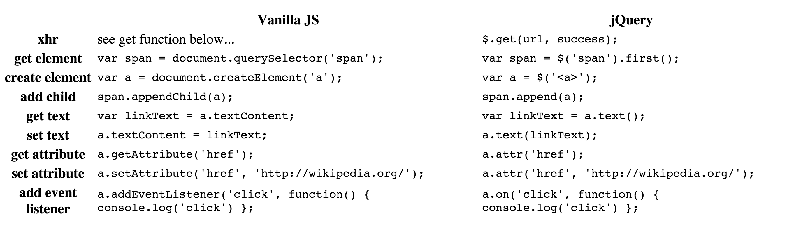

#Day 8 of FEWD 39!

#API's and Final Projects

##Today's Objectives

By the end of this lesson, you will be able to:

- Learn about API's
- Apply your existing knowledge of Javascript or jQuery to manipulate the DOM using data retrieved from these API's.
- Incorporate new information learned today in your wireframes for your final project

## Review of Wireframes (30 min)

* Find a partner and show off your wireframes for your final project
* Your wireframes should help guide your development
* It doesn't have to be super detailed in design. Even square boxes or circles suffice as placeholders

============================

## Review of Todo-List Lab (using JS and jQuery)
* Why do we use a "form" tag? Select for the <form> tag in JS and jQuery
* What is [event.preventDefault()?](http://www.w3schools.com/jsref/event_preventdefault.asp)

		event.preventDefault()

	* The preventDefault() method cancels the event if it is cancelable, meaning that the default action that belongs to the event will not occur.

_For example, this can be useful when:_

* Clicking on a __"Submit"__ button, prevent it from submitting a form
* Clicking on a __link__, prevent the link from following the URL

============

## Quick Cheatsheet Screenshot

=================

##API's--what are they?

####Here's an easy-to-read article on what API's are about: [http://readwrite.com/2013/09/19/api-defined](http://http://readwrite.com/2013/09/19/api-defined)

In order to access data from an API, we will need to make an :   XMLHttpRequest (see: [https://developer.mozilla.org/en-US/docs/Web/API/XMLHttpRequest](http://developer.mozilla.org/en-US/docs/Web/API/XMLHttpRequest))

####What is XMLHttpRequest? 
* XMLHttpRequest is an API that provides client functionality for transferring data between a client and a server. 
* It provides an easy way to retrieve data from a URL without having to do a full page refresh. This enables a Web page to update just a part of the page without disrupting what the user is doing.  
* XMLHttpRequest is used heavily in AJAX programming.

	__What is AJAX?__
	
* AJAX stands for Asynchronous JavaScript and XML.
* It is a way to send and receive data from a server (the back end) _after the page has already been loaded, and without reloading it._
* AJAX accepts and operates through the [REST](http://en.wikipedia.org/wiki/Representational_state_transfer) convention. 
* It bridges the gap between front end and back end in a user-friendly way.

####Another definition for: XMLHttpRequest (or XHR) 
* it is another Javascript object that a browser provides. It is used for retrieving data from a URL for use in your code.

__The following function uses XMLHttpRequest to get data from a url and then passes the data to another function to handle on success:__

		function get(url, success) {
  			var xhr = new XMLHttpRequest();

  			xhr.addEventListener("readystatechange", function() {
    			if (xhr.readyState == 4 && xhr.status == 200) {
      				success(JSON.parse(xhr.response));
    				}
  				});

  			xhr.open("GET", url);
  			xhr.send();
		}
The above code is handy for getting some data from a URL (for example, the OMDB JSON API) to do something with in your final project!

####_jQuery has a method just like this, which you can call like this:_ 
		
		$.get(url, callback function)

===========

## OMDP Movie API 

####see: [http://www.omdbapi.com/](http://www.omdbapi.com/)

* Review the examples on this site to determine what gets returned from this API
* Install Chrome extension ([JSONView](http://chrome.google.com/webstore/detail/jsonview/chklaanhfefbnpoihckbnefhakgolnmc?hl=en))

#### What gets returned? JSON!
* JSON is used widely throughout applications that use JavaScript because its format is simply a JavaScript object.
* As a result, JSON objects have keys and values, and these can also be nested inside of each other.
* Multiple data types can also be present in these objects such as arrays, integers, strings, etc.
* Let's see a nested example:

		var userInfo = {
    		firstname: "Arun",
    		lastname: "Sood",
    		role: "Instructor",
    		pets: [
        		{
            		name: "Fido",
            		type: "Dog",
            		favorite_toy: "Tennis ball",
            		age: 7
        		},
        		{
            		name: "Kitty",
            		type: "Cat",
            		favorite_toy: "Feather on a stick",
            		age: 3
        		}
    		],
    		favorite_number: 10
		};

##Lab #1:  OMDB API and DOM

* From your starter code, move all the CSS, and JS onto different their own folders, link up jQuery library to the HTML DOC.  Set up the files as if this was your own project
* Code - along:  code the results in our DOM using Javascript or jQuery
* Review [forEach()](https://developer.mozilla.org/en-US/docs/Web/JavaScript/Reference/Global_Objects/Array/forEach)

		array.forEach(callback function)		
		
Here's an example:

		 var instructors = ['Celeste', 'Melody', 'Sandi'];

  		 var list = document.querySelector('ul');

			function listInstructor(instructor) {
				 var item = document.createElement('li');
				 item.textContent = instructor;
				 list.appendChild(item);
 			 }
 			 
 		  instructors.forEach(listInstructor);

###Lab #2/Homework #1

* __Can you add an image to the results of Lab#1?  Try it yourself!__  

	

=========

## One on one with each student to go over their final project ideas

* What is your final project about? MVP? (Minimal Viable Product)
* What tools, libraries will they need to use?  
	* jQuery?
	* Bootstrap?
	* Wow.js?
	* Animate.css?
	* others?
	
* Will you use any API's?
	* OMDB?
	* Spotify?
	* Google Map? 
	
* Are they within scope?

==============

###Homework #2!!   
##### Bring your _pre-FINAL_ project website to class to discuss with teaching staff  (at least 50% coded or psuedo-coded)